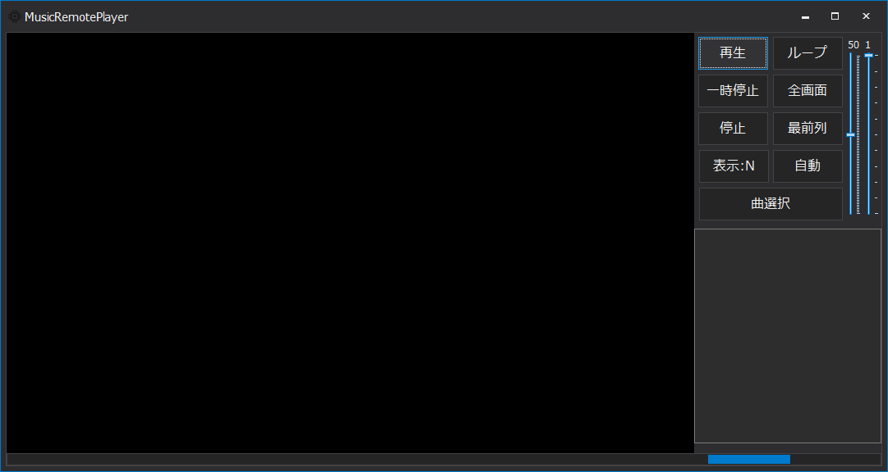

## 使用技術一覧
<!-- シールド一覧 -->
<!-- 該当するプロジェクトの中から任意のものを選ぶ-->

  <!-- バックエンドのフレームワーク一覧 -->
  
 

## プロジェクト名
### Music-Remote-Player

## 目次

1. [プロジェクトについて](#プロジェクトについて)
2. [環境](#環境)
3. [実行方法]("実行方法)
4. [機能説明](#機能説明)

## プロジェクトについて
音楽や動画を再生できるプレイヤーです。モニターが複数あるため、作業しながらカーソル移動して曲を変える操作に手間がかかるので、キー操作にて曲変更や再生等ができるプレイヤーを作りました。
    

## デモ(図解)

  

## 環境

<!-- 言語、フレームワーク、ミドルウェア、インフラの一覧とバージョンを記載 -->

| 言語・フレームワーク ・ライブラリー | バージョン |
| --------------------- | ---------- |
| C++           | 3.12.5     |
|   .NET Framework                      |   4.7.2        |

### 実行方法

Githubにリリースされた実行ファイルをダウンロードして起動してください。

## 機能説明
【機能】

再生・ループ・一時停止・全画面・停止・最前列・表示：Ｎ・自動・曲選択の全9つの機能があります。曲選択では複数の曲をリストに加えることが出来ます。

【ショートカットキー】

Ctrl + Shift + Up = 表示・非表示

Ctrl + Shift + Right = 1つ後の曲を選択

Ctrl + Shift + Left = 1つ前の曲を選択

Ctrl + Shif + R = ループ

Alt + Ctrl + Shif + R = ループ解除
